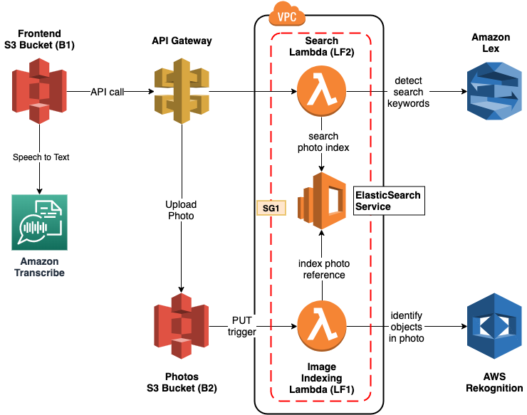

# COMS6998_Photo Album Web App
### Overview
This is the Assignment 2 for course COMS6998: Cloud Computing and Big Data at Columbia University.
The task is to implement a photo album web application that can be searched using natural language through both text and voice.

### Deployed S3 Frontend Link

http://cs6998-latias-photos.com.s3-website-us-east-1.amazonaws.com/  
Note the link will be set expired after grading period.

### Architecture
The VPC is not implemented.

### Team Members
- Songheng Yin, sy3079
- Yiming Zhu, yz4336
